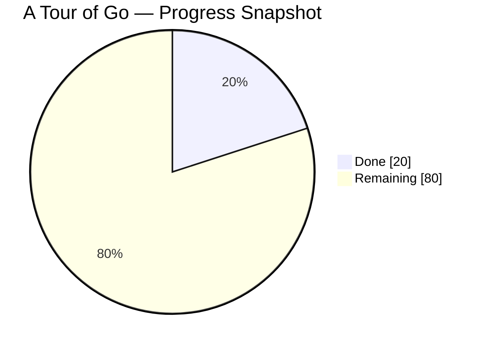

# A Tour of Go Learning Repo

Учебный репозиторий по Go. Здесь я прохожу официальный курс `A Tour of Go`, параллельно пробую модули, пакеты, форматирование кода, обработку ошибок и простую структуру проектов.

## Progress

Текущий прогресс ниже — это аккуратная оценка по содержимому репозитория на сегодня, а не автоматический подсчёт.

**Общий прогресс: 20%**

`[####................] 20%`



### Progress By Topic

| Topic | Status | Progress |
| --- | --- | ---: |
| Basics | In progress | 65% |
| Flow control | In progress | 35% |
| More types | Started | 20% |
| Methods and interfaces | Planned | 0% |
| Generics | Planned | 0% |
| Concurrency | Planned | 0% |

## What Is Already In The Repo

- Работа с двумя Go-модулями: `greetings` и `hello`
- Импорт локального модуля через `replace`
- Простая функция приветствия с возвратом `message, error`
- Использование `fmt`, `errors`, `log`, `math/rand`, `os`
- Запись логов в файл `hello/test.log`
- Отдельный модуль `calculator` для практики цикла `for`
- Отдельный модуль `count-evens-leetcode-test-task` для первой мини-задачи в стиле `LeetCode`
- Практика `for`, `range`, `if/else`, подсчёта значений и прохода по `slice`

## Repository Structure

```text
.
├── CHANGELOG.md
├── README.md
├── calculator/
│   ├── go.mod
│   └── main.go
├── count-evens-leetcode-test-task/
│   ├── go.mod
│   └── main.go
├── greetings/
│   ├── go.mod
│   └── greetings.go
└── hello/
    ├── go.mod
    ├── hello.go
    ├── hello.go.bak
    └── test.log
```

## Modules

### `greetings`

Небольшой пакет, который:

- принимает имя,
- формирует приветствие в случайном формате,
- проверяет пустой ввод,
- пишет лог в файл.

### `hello`

Минимальное приложение, которое импортирует пакет `greetings`, вызывает `Hello("Gladys")` и печатает результат.

### `calculator`

Небольшой учебный модуль для тренировки базового цикла `for`:

- суммирование в цикле;
- работа со счётчиком;
- связь синтаксиса Go с простыми числовыми задачами.

### `count-evens-leetcode-test-task`

Первый модуль с задачей в стиле `LeetCode`, который:

- проходит по массиву двумя способами;
- использует `if/else` для проверки чётности;
- считает количество чётных и нечётных значений;
- закрепляет разницу между классическим `for` и `for range`.

## Run

Запуск примера:

```powershell
cd hello
go run .
```

Если нужно проверить пакет отдельно:

```powershell
cd greetings
go test ./...
```

## Learning Notes

Этот репозиторий сейчас выглядит как ранний этап обучения с уже закрытой базой по нескольким важным темам:

- основы синтаксиса уже тронуты;
- работа с модулями уже понятна на практике;
- обработка ошибок и базовая работа с файлами уже появились;
- циклы `for` и `range` уже отрабатываются на отдельных упражнениях;
- первое условие `if/else` уже связано с задачей на массив;
- следующие большие темы — `switch`, `slice`, `map`, `struct`, методы и интерфейсы.

## Next Milestones

- Добавить примеры по `switch` и `defer`
- Добавить упражнения по `slice`, `map`, `struct`
- Переписать мини-задачу на чётные числа в виде функции `countEvens(nums []int) int`
- Добавить первые маленькие тесты к учебным задачам
- Дойти до методов и интерфейсов
- Повысить общий прогресс до `30%+`

## Changelog

История изменений ведётся в [CHANGELOG.md](./CHANGELOG.md).
