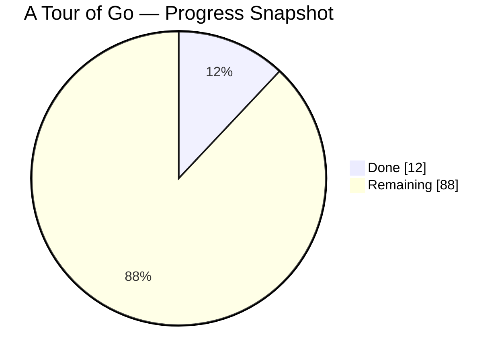

# A Tour of Go Learning Repo

Учебный репозиторий по Go. Здесь я прохожу официальный курс `A Tour of Go`, параллельно пробую модули, пакеты, форматирование кода, обработку ошибок и простую структуру проектов.

## Progress

Текущий прогресс ниже — это аккуратная оценка по содержимому репозитория на сегодня, а не автоматический подсчёт.

**Общий прогресс: 12%**

`[##..................] 12%`



### Progress By Topic

| Topic | Status | Progress |
| --- | --- | ---: |
| Basics | In progress | 45% |
| Flow control | Started | 10% |
| More types | Started | 15% |
| Methods and interfaces | Planned | 0% |
| Generics | Planned | 0% |
| Concurrency | Planned | 0% |

## What Is Already In The Repo

- Работа с двумя Go-модулями: `greetings` и `hello`
- Импорт локального модуля через `replace`
- Простая функция приветствия с возвратом `message, error`
- Использование `fmt`, `errors`, `log`, `math/rand`, `os`
- Запись логов в файл `hello/test.log`

## Repository Structure

```text
.
├── CHANGELOG.md
├── README.md
├── greetings/
│   ├── go.mod
│   └── greetings.go
└── hello/
    ├── go.mod
    ├── hello.go
    ├── hello.go.bak
    └── test.log
```

## Modules

### `greetings`

Небольшой пакет, который:

- принимает имя,
- формирует приветствие в случайном формате,
- проверяет пустой ввод,
- пишет лог в файл.

### `hello`

Минимальное приложение, которое импортирует пакет `greetings`, вызывает `Hello("Gladys")` и печатает результат.

## Run

Запуск примера:

```powershell
cd hello
go run .
```

Если нужно проверить пакет отдельно:

```powershell
cd greetings
go test ./...
```

## Learning Notes

Этот репозиторий сейчас выглядит как ранний этап обучения:

- основы синтаксиса уже тронуты;
- работа с модулями уже понятна на практике;
- обработка ошибок и базовая работа с файлами уже появились;
- следующие большие темы — структуры, методы, интерфейсы и конкурентность.

## Next Milestones

- Добавить примеры по `for`, `switch`, `defer`
- Добавить упражнения по `slice`, `map`, `struct`
- Дойти до методов и интерфейсов
- Добавить небольшие учебные тесты
- Повысить общий прогресс до `25%+`

## Changelog

История изменений ведётся в [CHANGELOG.md](./CHANGELOG.md).
